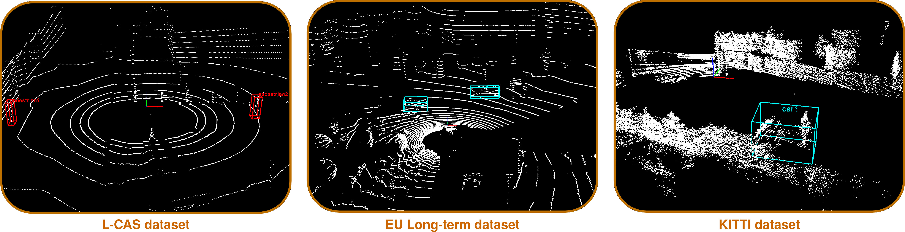
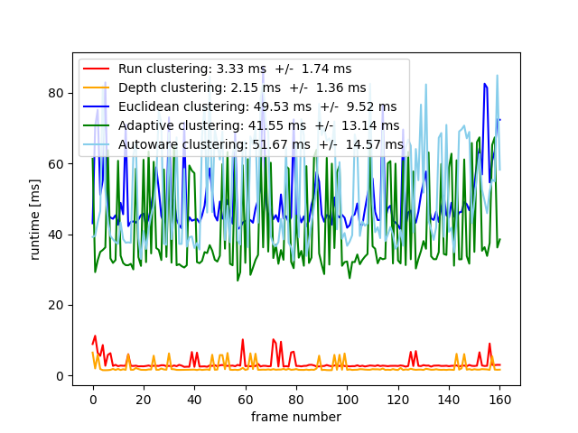
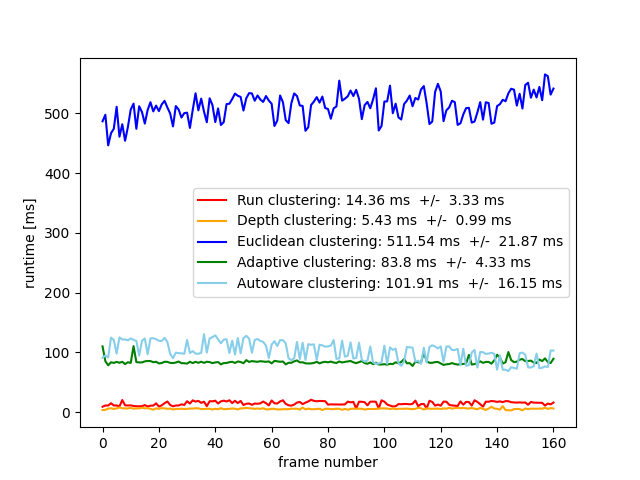
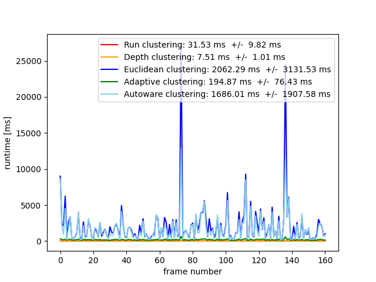

# LiPC: LiDAR Point Cloud Clustering Benchmark Suite

LiPC is a benchmark suite for point cloud clustering algorithms based on open-source software and open datasets. It aims to provide the community with a collection of methods and datasets that are easy to use, comparable, and that experimental results are traceable and reproducible. We look forward to the results of other methods using our suite.



## Evaluated methods

1. [adaptive_clustering](adaptive_clustering)
2. [autoware_clustering](autoware_clustering)
3. [depth_clustering](depth_clustering)
4. [euclidean_clustering](euclidean_clustering)
5. [run_clustering](run_clustering)

## Datasets

We ran the above open-source methods on three open datasets and the experimental results are illustrated in [Benchmarking](#Benchmarking). All the three datasets were collected outdoors using three different LiDARs including, a Velodyne VLP-16 for the [L-CAS dataset](https://github.com/yzrobot/cloud_annotation_tool), a Velodyne HDL-32E for the [EU Long-term dataset](https://epan-utbm.github.io/utbm_robocar_dataset/), and a Velodyne HDL-64E for the [KITTI dataset](http://www.cvlibs.net/datasets/kitti/). The first one was collected in a parking lot with a stationary robot, which contains two fully labeled pedestrians, for which neither occlusion nor truncation on the samples. The other two datasets were collected in urban road environments with automobile platforms, of which the EU Long-term dataset provides car labels in a roundabout, while the KITTI one includes annotations of various vehicle types.

### Perfection

Instead of counting how many clusters were correctly segmented, more precisely, we calculate the 3D Intersection over Union (IoU) between the clustering box and the ground truth box. The maximum IoU of a ground truth box is first calculated, and then the average IoU of all the ground truth boxes is taken as the final result. As we focuses on the clustering precision evaluation without considering the frame loss caused by running speed, we play the point cloud data at a very slow speed to ensure that the algorithms can output almost every frame's clustering results.

We also roughly estimated the [ring_number](laser_ring) (corresponding to the scan layer of LiDAR) missed in the point cloud data of KITTI by calculating the vertical angle of a laser to meet the operating requirements of run clustering and depth clustering.

### Annotation

Although the raw data used are from different datasets, with or without labels, we used the [# L-CAS 3D Point Cloud Annotation Tool](https://github.com/yzrobot/cloud_annotation_tool) to uniformly relabel them to ensure high ground truth accuracy. In particular, we first used [ray ground filter](points_ground_filter) method to remove ground point clouds from all data. The main idea of ray ground filter is to segment the ground by calculating the height change of a point in the angular differential region in the x-y plane and setting the threshold.

Since different surfaces of a vehicle, like the car body, the window glass, and the front grill, have different reflectivity for a laser, the point cloud on the vehicle is usually incomplete and shown as separated parts. Nevertheless, for EU Long-term and KITTI datasets, we assigned a single bounding box containing all the points of the same vehicle.

Each frame's annotation is contained in a text file named as the frame but with extension *.txt*. Each line in the text file represents a label, which has eleven columns with various information:

* Column 1: category (pedestrian, car, etc.)
* Column 2-4: bounding box centroid (x-y-z)
* Column 5-7: minimum bound (x-y-z)
* Column 8-10: maximum bound (x-y-z)
* Column 11: visibility (0 = visible, 1 = partially visible)

### Download links:

- L-CAS dataset
  - China: https://pan.baidu.com/s/1vups6uxU4P0yjnuQJos4Pw code: 9gqb
  - Other: https://drive.google.com/drive/folders/1ShVEApMw0Ur94zVhNq_PYNnPbbFr4LZj?usp=sharing
- EU Long-term dataset
  - China: https://pan.baidu.com/s/1nV8VE8duoQMsZSjjCxEdvw code: y91e
  - Other: https://drive.google.com/drive/folders/12OG-uVjGKlQqp9WV5Fp2Nk06E2baN9dD?usp=sharing
- KITTI dataset
  - China: https://pan.baidu.com/s/1m04n7oFoAu5vPPaIlx4xGQ code: 8nb8
  - Other: https://drive.google.com/drive/folders/1xbjbVyfn17L3InwUbxA7OcoZ0Kbd7dAT?usp=sharing

## How to run

Please check the README file in each method folder. We also provide the [launch files](launch) for easy testing. In general, we assume you have [Ubuntu](https://ubuntu.com/download/desktop) and [ROS](http://wiki.ros.org/Documentation) installed.

## Understand the results

When you run different clustering methods on different datasets, you will see some output like this in your terminal:

`0 1555085894.657905000 -0.218633 -1.01313 -0.302942 0.733374 -0.193833 -0.0957511`

* Column 1: frame number
* Column 2: timestamp (so you will know how fast your method runs)
* Column 3-5: minimum bound (x-y-z)
* Column 6-8: maximum bound (x-y-z)

As some examples, our results can be found [here](results). If you have results about other methods, please don't hesitate to submit them to us.

## Benchmarking

The experiments were carried out with Ubuntu 18.04 LTS (64-bit) and ROS Melodic, with an Intel i7-7700HQ processor (only one core is used), 16 GB memory, and without GPU processing. Scripts to generate IOU and runtime results can be found [here](evaluation).

From a [software engineering perspective](http://www.mdpi.com/2218-6581/6/3/21), an explicit experimenter design is essential. Below we give the detailed experimental parameters.

| Approach | Ground removal | Min/Max points | Clustering θ |
| - | - | - | - |
| adaptive_clustering | -0.8m/-1.25m/-1.5m | 5/2.2 million | adaptive |
| autoware_clustering | -0.8m/-1.25m/-1.5m | 5/2.2 million | 0.75 m |
| depth_clustering | 7&deg; | 5/2.2 million | 10&deg; |
| euclidean_clustering | -0.8m/-1.25m/-1.5m | 5/2.2 million | 0.75 m |
| run_clustering | ParamsGPF | 2/2.2 million | ParamsSLR |

*ParamsGPF = {Nsegs = 3, Niter = 3, NLPR = 20, Thseeds = 0.4m, Thdist = 0.2m}*

*ParamsSLR = {Thrun = 0.5m, Thmerge = 1m}*

### Precision

* L-CAS dataset

| Ranking | Approach | IoU |
| - | - | - |
| 1 | adaptive_clustering  | 62.38% |
| 2 | autoware_clustering | 50.68% |
| 3 | euclidean_clustering | 39.26% |
| 4 | run_clustering | 37.63% |
| 5 | depth_clustering | 14.61% |

* EU Long-term dataset

| Ranking | Approach | IoU |
| - | - | - |
| 1 | run_clustering  | 35.97% |
| 2 | autoware_clustering | 34.00% |
| 3 | adaptive_clustering | 32.99% |
| 4 | depth_clustering | 28.72% |
| 5 | euclidean_clustering | 14.78% |

* KITTI dataset

| Ranking | Approach | IoU |
| - | - | - |
| 1 | depth_clustering  | 42.69% |
| 2 | adaptive_clustering | 33.24% |
| 3 | autoware_clustering | 32.15% |
| 4 | euclidean_clustering | 30.63% |
| 5 | run_clustering | 29.25% |

### Runtime

* L-CAS dataset



* EU Long-term dataset



* KITTI dataset



## Copyright

Please check [here](LICENSE).

## Citation

If you are considering using this repository, please reference the following:

```
@article{yt24review,
author = {Yang, Tao and Hu, Jinwen and Li, You and Zhao, Cheng and Sun, Li and Krajnik, Tomas and Yan, Zhi},
title = {3D ToF LiDAR for Mobile Robotics in Harsh Environments: A Review},
journal = {Unmanned Systems},
year = {2024},
doi = {10.1142/S230138502530001X},
}
```
